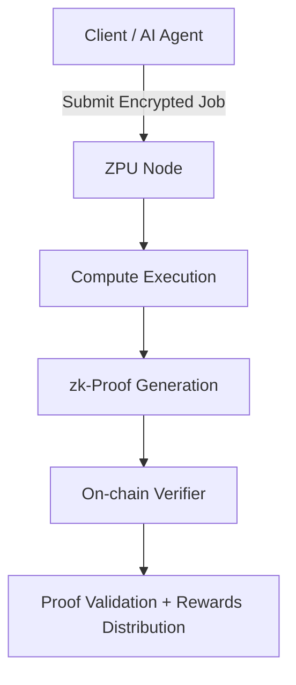

# NZIDIA – The ZPU Network  
**The Decentralized Compute Layer for Private AI**  

---

## 🧠 Introduction  

**NZIDIA** is building the **ZPU (Zero-Knowledge Processing Unit)** — a decentralized, privacy-first compute network that redefines how AI and high-performance computation are executed on-chain.  

While **GPUs** powered the centralized AI revolution, **ZPUs** are the cryptographically verifiable evolution — decentralized compute units that enable **private, permissionless, and verifiable computation** using zero-knowledge proofs (zkSNARKs).  

> **ZPU = GPU × ZK × Web3**  
> Compute without exposure. Verify without trust.  

---

## ⚙️ Architecture Overview  

### ZPU Network Layers  
The NZIDIA network is composed of four primary layers:  

1. **Client Layer** – The interface for developers and agents to submit compute requests using the NZIDIA SDK or REST API.  
2. **ZPU Node Layer** – A network of decentralized compute providers that execute workloads securely within zero-knowledge environments.  
3. **Proof Layer (zkSNARK Engine)** – Validates computations cryptographically without revealing inputs, intermediate states, or model parameters.  
4. **Consensus & Settlement Layer** – Anchored on ZCash-based zero-knowledge ledgers, ensuring integrity, staking, and rewards.  

---

## 🧩 ZPU Node Design  

Each **ZPU Node** acts as a **micro datacenter**, executing encrypted compute workloads and producing zk-proofs of correctness. Nodes can be GPU-backed, CPU-backed, or hybrid configurations optimized for zkVM workloads.  

### Node Components
- **Executor**: Runs the compute task inside a ZK-sandboxed container.  
- **Prover**: Generates zkSNARKs attesting to correctness of execution.  
- **Verifier**: Submits proof to on-chain verifier contracts.  
- **Staker**: Locks $NZIDIA tokens to ensure honesty and anti-Sybil guarantees.  

### Proof Workflow
1. User submits a task to the ZPU Network.  
2. Task is encrypted and dispatched to an available node.  
3. Node executes computation and generates zkSNARK proof.  
4. Proof is verified by the on-chain Verifier module.  
5. Node receives $NZIDIA rewards after successful verification.  

---

## 🔬 zkCompute Pipeline  

The ZPU framework uses a **deterministic zkVM** to ensure reproducibility across all compute nodes.  



### Technical Stack
- **zkSNARK Circuit**: Groth16 / Halo2-based proof system.  
- **ZPU Runtime**: Rust + WASM zkVM for sandboxed execution.  
- **ZPU Network Orchestrator**: libp2p-based node discovery and task allocation.  
- **Consensus**: PoS + zkProof-based reputation weighting.  
- **Payment Layer**: $NZIDIA ERC-20 compatible token with streaming payments.  

---

## 🧱 Smart Contract Modules  

| Contract | Function | Description |
|-----------|-----------|-------------|
| `ZPURegistry` | Node Registration | Registers nodes, manages stakes and reputations |
| `ZPUJobs` | Job Marketplace | Handles compute job submissions and matching |
| `ZPUProofVerifier` | Proof Verification | Validates zkSNARK proofs for task correctness |
| `ZPUTreasury` | Token Distribution | Manages staking rewards and job payouts |

---

## 💡 Developer SDK  

### Node Setup  

```bash
git clone https://github.com/nzidia/zpu-node
cd zpu-node
cargo build --release
./target/release/zpu-node --register-node --stake 1000NZIDIA
```

### Client SDK  

```javascript
import { ZPUClient } from "@nzidia/sdk";

const client = new ZPUClient("https://api.nzidia.com");

const result = await client.submitJob({
  model: "private-llm-v1",
  input: { prompt: "Generate zk-secure summary" },
  maxBudget: 2500,
});

console.log("Job ID:", result.jobId);
console.log("Proof URL:", result.proofUrl);
```

---

## 🔒 Security & Privacy Model  

### Core Guarantees  
- **Zero Data Leakage**: All job inputs, weights, and outputs are encrypted end-to-end.  
- **Verifiable Execution**: zkProofs guarantee deterministic computation.  
- **Censorship Resistance**: Decentralized node orchestration via libp2p.  
- **Economic Security**: Nodes stake $NZIDIA; slashed upon invalid proofs or downtime.  

---

## 💰 Tokenomics Summary ($NZIDIA)  

| Utility | Description |
|----------|-------------|
| **Compute Payments** | Pay for ZPU cycles to execute private compute workloads |
| **Staking** | Lock tokens to operate ZPU nodes and earn rewards |
| **Governance** | Vote on protocol upgrades and proof system integrations |
| **Rewards** | Earned by nodes for verified computation |

---

## 🧭 Roadmap  

| Phase | Milestone | Description |
|--------|------------|-------------|
| **Q1 2025** | ZPU Node MVP | Launch of testnet with zkCompute validation |
| **Q2 2025** | ZAI Agent Framework | AI agents integrated into ZPU SDK |
| **Q3 2025** | Mainnet Launch | Full staking, governance, and reward system live |
| **Q4 2025** | ZPU Marketplace | Open decentralized compute exchange |

---

## 📡 Contributing  

We welcome contributions in:  
- zkSNARK circuits optimization  
- Distributed systems (libp2p, P2P messaging)  
- Node reliability and sandboxing  
- SDK development (Rust, JS, Python bindings)  

```bash
git clone https://github.com/nzidia/nzidia
git checkout -b feature/your-feature
cargo test && cargo fmt
git push origin feature/your-feature
```

---

## 🧬 License  
This project is licensed under the **MIT License** — open for builders, researchers, and zk pioneers.

---

## 🌐 Links  
- Website: [https://nzidia.com](https://nzidia.com)  
- Docs: [https://nzidia.com/docs](https://nzidia.com/docs)  
- GitHub: [https://github.com/nzidia](https://github.com/nzidia)  
- Twitter: [@nzidia_ai](https://x.com/nzidiazpu)

> _“ZPU is to Private AI what GPU was to Deep Learning.”_
